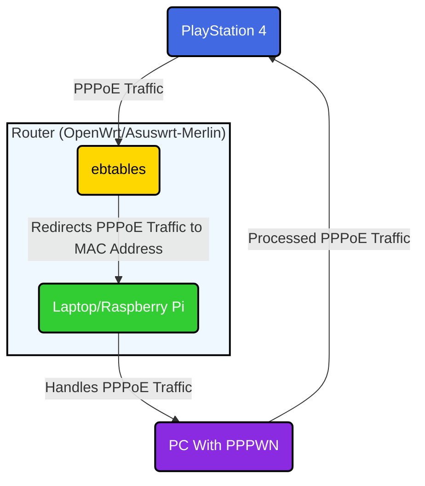

# PPPWN Sink

## Introduction

I needed to **PPPWN** multiple PlayStations at once, but using OpenWrt or directly connecting the cable was not a sustainable method. 
The router often crashed and couldn't handle multiple versions. 

This guide is the first part of the **PPPWN Sink** exploit. With this method, you can jailbreak your PS4 by leveraging the power of another device.

Any machine is faster and more robust than a **Luckyfox** or **OpenWrt** device.

---

### Diagram


## Steps to Set Up PPPWN Sink

### 1. Get the MAC Address of Your Network Card (or Raspberry Pi)

Before you can redirect **PPPoE** traffic to your computer or Raspberry Pi, you need to find the MAC address of your network card or Pi’s interface.

#### Linux/macOS:
Open a terminal and run:
```bash
ifconfig
```
Look for the **HWaddr** or **ether** value. Example:
```
d8:5e:d3:89:df:cf
```

#### Windows:
1. Open **Command Prompt** by pressing `Windows Key + R`, typing `cmd`, and hitting Enter.
2. In the Command Prompt, type:
   ```bash
   ipconfig /all
   ```
3. Look for the **Physical Address** entry under your active network adapter (either Wi-Fi or Ethernet). Replace the dashes with colons:
   ```
   d8:5e:d3:89:df:cf
   ```

#### Raspberry Pi:
If you plan to redirect the **PPPoE** traffic to a Raspberry Pi, use the following command on your Pi to get the MAC address:
```bash
ifconfig
```

### 2. Install ebtables on the Router

If **ebtables** isn’t installed on your router yet, you can install it using **opkg** (commonly used in OpenWrt, Asuswrt-Merlin, Tomato, etc.):

```bash
opkg install ebtables
```

### 3. Redirect PPPoE Discovery and Session Traffic

To redirect **PPPoE** packets (both discovery and session) to your network card or Raspberry Pi, run the following commands on the router:

```bash
MACADDRESS='d8:5e:d3:89:df:cf'
# Clear the PREROUTING chain first
ebtables -t nat -F PREROUTING

# Add the rules using the environment variable for MAC address
ebtables -t nat -A PREROUTING -i br0 -p 0x8863 -s ! $MACADDRESS -j dnat --to-destination $MACADDRESS
ebtables -t nat -A PREROUTING -i br0 -p 0x8864 -s ! $MACADDRESS -j dnat --to-destination $MACADDRESS

# Add the general rules (without MAC exclusion)
ebtables -t nat -A PREROUTING -p 0x8863 -j dnat --to-destination $MACADDRESS
ebtables -t nat -A PREROUTING -p 0x8864 -j dnat --to-destination $MACADDRESS

```

Replace `d8:5e:d3:89:df:cf` with the actual MAC address of your network card or Raspberry Pi.

### 4. Make the ebtables Rules Persistent (Optional)

By default, **ebtables** rules won’t persist after a reboot. To make these rules persistent, you need to add them to a startup script. On routers like **OpenWrt**, **Asuswrt-Merlin**, or **Tomato**, you can add the commands to the startup configuration:

For **OpenWrt**:
1. SSH into your router.
2. Edit the `/etc/rc.local` file:
   ```bash
   vi /etc/rc.local
   ```
3. Add the following commands before `exit 0`:
   ```bash
   ebtables -t nat -A PREROUTING -p 0x8863 -j dnat --to-destination d8:5e:d3:89:df:cf
   ebtables -t nat -A PREROUTING -p 0x8864 -j dnat --to-destination d8:5e:d3:89:df:cf
   ```
4. Save and exit.

This will ensure the redirection is automatically applied every time your router boots.

### 5. Remove Redirection or Change MAC Address

If you want to remove the redirection or change the MAC address, you can do so by deleting the existing **ebtables** rules in /etc/rc.local or simply rebooting the router:

#### To Remove the Redirection:
```bash
ebtables -t nat -D PREROUTING -p 0x8863 -j dnat --to-destination d8:5e:d3:89:df:cf
ebtables -t nat -D PREROUTING -p 0x8864 -j dnat --to-destination d8:5e:d3:89:df:cf
```

#### To Change the MAC Address:
First, remove the existing redirection as shown above, then add the new rules with the updated MAC address:
```bash
ebtables -t nat -A PREROUTING -p 0x8863 -j dnat --to-destination NEW_MAC_ADDRESS
ebtables -t nat -A PREROUTING -p 0x8864 -j dnat --to-destination NEW_MAC_ADDRESS
```

### 6. Launch Your PPPWN Exploit

Now that your router is redirecting **PPPoE** traffic to your network card or Raspberry Pi, you can launch your **PPPWN exploit** on your computer or Raspberry Pi. Make sure you select the network interface you’ve configured for redirection.

### 7. P~~rofit~~ppwn

Once the redirection is set, your computer or Raspberry Pi will handle the **PPPoE** traffic, allowing you to proceed with your **PPPWN exploit** without worrying about the limitations of weak devices. 

## Tips for Pros

- You can monitor incoming **PPPoE** discovery packets with **tcpdump**:
   ```bash
   sudo tcpdump -i wlan0 ether proto 0x8863
   ```

## Compatibility

This guide works on routers that support **iptables** and **ebtables**, such as:
- **OpenWrt**
- **Asuswrt-Merlin**
- **FreshTomato**
- Any other custom router firmware supporting **ebtables**
